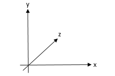
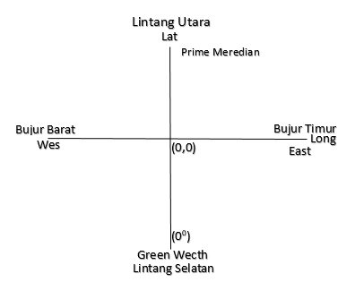

## RESUME

#GEOGRAPHICAL INFORMATION SYSTEM

1.Pengertian GIS
Sistem = suatu alur atau sekelompok komponen dan elemen.
Informasi = Sekumpulan pesan atau hasil pengolahan data pada informasi tersebut
Geografis = Bentuk bumi yang mempunyai suatu koordinat
Jadi kesimpulan dari Sistem Informasi Geografis adalah sekelompok kompenen, elemen dan alur yang menjelaskan pengolahan data atau sekumpulan pesan yang terjadi pada bentuk bumi.

  

2. Geospasial
Adalah suatu ruang yang menunjukan suatu posisi yang tepat
contoh gambar dibawah ini :
 
3. Koordinat
Koordinat adalah sesuatu yang menunjukan titik letak nya bumi berdasarkan garis lintang  dan garis bujur. Ada koordinat Latitude dan ada Longitude.
Jadi di ada titik koordinat (0,0) dan titik 00 itu berada di Inggris tempat nya berada di Greenwetch. Dibawah ini adalah contoh gambar koordinat.
  
  

  

Kesimpulan 
Kita harus tau terlebih dahulu dimana letak titik koordinat 00 dan harus mengerti bagaimana cara memakai aplikasi GIS tersebut
Saran
Lebih lanjut nya kita harus praktek tentang GIS tersebut.
