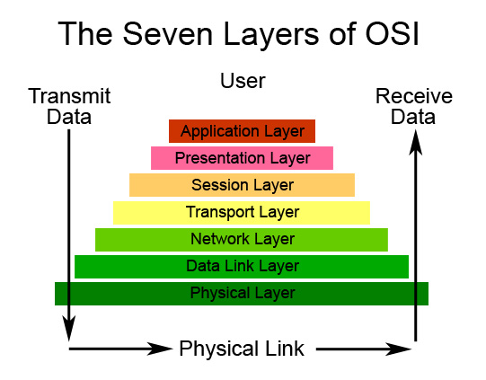
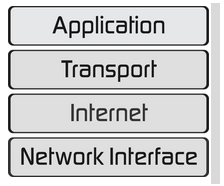

Resume Pertemuan 2 Sistem Informasi Geografis

Latar Belakang Masalah

1. Apa fungsi data vektor pada Geospasial?
2. Apa fungsi data raster pada Geospasial?

Data Vektor adalah suatu data yang menampilkan pola titik, kurva, garis atau polygon. Data vektor ini untuk mempresentasikan jaringan jalan, gedung dan letak koordinat.

  

Data vector ini hanya memerlukan ruang penyimpanan yang sedikit dan memiliki skala spasial yang tinggi, dan data vector ini memiliki struktur data yang kompleks.

Data Raster adalah suatu data yang menampilkan bentuk ruang bumi dalam bentuk pixel. Jadi resolusi gambar tergantung oleh jumlahpixel.

  

Data raster mudah untuk dimanipulasi dengan fungsi matematik sederhana serta memiliki struktur data yang sederhana. Jadi tempat penyimpanan yang besar maka hasil gambar tergantung dengan ukuran pixel

Penutup

Kesimpulan

Jadi dapat disimpulkan bahwa vector dan raster memiliki kekurangan dan kelebihan, vector untuk mempresentasikan letak koordinat dan raster yang tergantung dengan ukuran resolusi pixel.

Saran

Saran saya terus pelajari tentang vector dan raster, karena itu sangat penting untuk pembelajaran di matakuliah Sistem Informasi Geografis.
