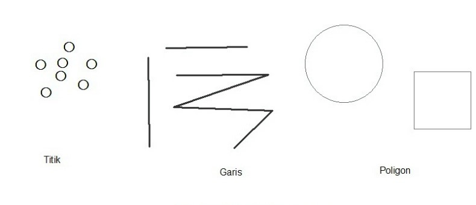

**Rangkuman Pertemuan 3 Sistem Informasi Geografis**

 

  

 
Latar Belakang Masalah

Didalam sistem informasi geografis terdapat 2 format data spasial yaitu data vektor geosapsial dan data raster geospasial. Data vektor disini dapat mempresentasikan bumi sebagai sebuah garis , polygon dan titik, dengan menggunakan beberapa langkah praktikum kita dapat mencari info tentang jumlah seperti jumlah kota yang ada pada beberapa lokasi dengan menggunakan penerapan data vektor ini.

1. Apa yang ada didalam data vektor?
2. Apa fungsi dari Shapefile/shp?
3. Apa saja yang harus digunakan untuk melihat jumlah shapefile?
4. Apa saja contoh method yang ada pada shapefile?
5. Apa yang diperlukan untuk melhat jumlah shapefile?

Data Vektor adalah suatu data yang menampilkan pola titik, kurva, garis atau polygon. Di data vektor terdapat class, yaitu shapefile atau shp.

Dengan menggunakan shapefile ini, bisa melakukan perhitungan jumlal seperti menghitung jumlah kota yang ada pada ruang lingkup tertentu dengan menggunakan  beberapa sistem.

Sistem untuk melakukan perhitungan ataupun melihat shapefile, kita menggunakan python karena tergolong mudah dalam penggunaannya.

Pada shapefile atau shp terdapat beberapa method, contohnya ada method Reader dan shape. Untuk method Reader berfungsi untuk membaca data yang ada pada file shp, contoh **shapefile.Reader(&quot;shp/entol.shp&quot;).**  Jadi dari codingan tersebut kita dapet mendapatkan output jumlah dari data shp itu sendiri, contoh 23 data yang ada pada file shpnya.

Dalam melihat data pada shapefile menggunakan Python, Pyshp, dan pip yang dapat dijalankan di Command Prompt ataupun Terminal yang ada di Windows, Linux dan Mac dengan mudah.

Penutup

Kesimpulan

Dapet disimpulkan, bahwa untuk melihat data atau jumlah data yang ada pada shapefile melakukannya cukup mudah karena bisa dilakukan dengan Command Prompt, Terminal pada Windows, Linux maupun Mac dan cara penginstalan sistem

mudah dilakukan

Saran

Saran dari saya terus pelajari Python, Pyshp, pip, karena kita dapat mudah untuk menentukan jumlah shapefile seperti jumlah kota. Dan mudah digunakan nya menggunakan Command Prompt.

- Nama : Entol Achmad Fikry Ilhamy
- NPM : 1144115
- Kelas : 3C
- Prodi : D4 Teknik Informatika
- Mata Kuliah : Sistem Informasi Geografis

Referensi :  [http://www.diarypc.com/2014/01/pengertian-7-osi-layer-dan-tcpip.html](http://www.diarypc.com/2014/01/pengertian-7-osi-layer-dan-tcpip.html)

Scan Plagiarisme

1. [https://drive.google.com/open?id=0B84lVJ2VqAfRaGZuYlp0QnBJUlk](https://drive.google.com/open?id=0B84lVJ2VqAfRaGZuYlp0QnBJUlk)
2. https://drive.google.com/open?id=0B84lVJ2VqAfReVl5eHZvTlNLNkk