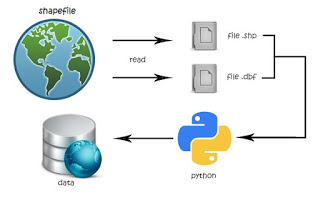

**Rangkuman Pertemuan 4 Sistem Informasi Geografis**

 
 
 

 Latar Belakang Masalah

Data ini terdiri dari pengamatan pengetahui titik koordinat dari melihat dunia nyata. Data spasial terdiri pengamatan dengan lokasii. Data spasial mengidentifikasi fitur dan posisi di permukaan bumii. Semua perangkat lunak GIS tellah dirancang untuk menangani data spasial dan untuk mempermudah.

1. Apa itu Retrive?
2. Apa itu SHP?
3. Apa saja yang terdapat dalam SHP?
4. Bagaimana operasi pengambilan data pada Phython?

Retrive Data Geospasial adalah salah satu cara untuk mengambil data geometri dan Database data geospasial dari file SHP.

Shapfile atau SHP merupakan data yang menyimpan data geometri didalamnya, yaitu :

1. Bbox adalah koordinat batas view di peta dan biasanya berbentuk persegi panjang di peta, bbox merupakan boundary box yaitu koordinat titik 4.
2. Shape Type ada 3 jenis, yaitu :

- Point : koordinat titik (1 titik/koordinat) bernomerkan standar 1 dari ESRI.
- PolyLine : koordinat titik-titik yang membentuk garis tapi tidak membentuk area bernomerkan standar 3 dari ESRII.
- Polygon : koordinat membentuk area bernomerkan standar 5 dari ESRI.

Operasi Pengambilan data dengan Python

Cara membaca Jumlah data Geometri :

- **--**** import shapefile**
- **--**** sf = shapefile.Reader(&quot;namafile.shp&quot;)**
- **--**** sf.shapes()**
- **--**** a = sf.shapes()**
- **--**** len(a)**

Cara membaca Jumlah data Geometri :

- **--**** import shapefile**
- **--**** sf.records()**
- **--**** sf.records(n)**

Penutup

Kesimpulan

Retrive Data Geospasial adalah salah satu cara untuk mengambil data geometri dan Database data geospasial dari file SHP, dimana data tersebut merupakan data vector yang merupakan salah satu jenis dari data geospasial.

Saran

Saran dari saya terus pelajari Retrieve data geospasial lebih dalam, agar kita tau lebih baik dan melakukan praktikum mandiri.

- Nama : Entol Achmad Fikry Ilhamy
- NPM : 1144115
- Kelas : 3C
- Prodi : D4 Teknik Informatika
- Mata Kuliah : Sistem Informasi Geografis

Referensi :

Link Github : [https://github.com/enfikry25/SistemInformasiGeografis](https://github.com/enfikry25/SistemInformasiGeografis)

Referensi :

1. [http://sigitprabowoo.blogspot.co.id/2013/06/sistem-informasi-geografis-ringkasan-sig.html](http://sigitprabowoo.blogspot.co.id/2013/06/sistem-informasi-geografis-ringkasan-sig.html)

Scan Plagiarisme

1. smallseotools - Link  [https://drive.google.com/open?id=0B84lVJ2VqAfRVnk3N2RibVQ3Ylk](https://drive.google.com/open?id=0B84lVJ2VqAfRVnk3N2RibVQ3Ylk)
2. searchenginereports - Link  [https://drive.google.com/open?id=0B84lVJ2VqAfRV2x3NXRBMllvb3c](https://drive.google.com/open?id=0B84lVJ2VqAfRV2x3NXRBMllvb3c)