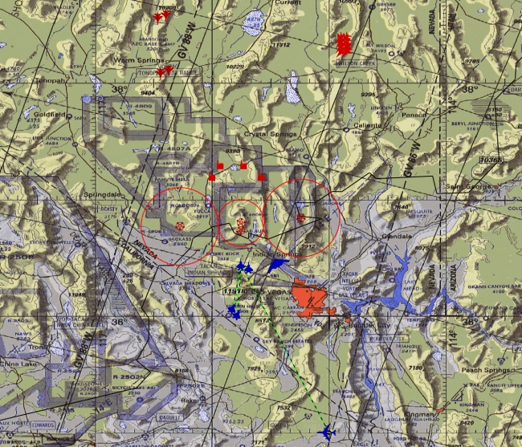

**Rangkuman Pertemuan 7 Sistem Informasi Geografis**

 
 
 

Latar Belakang Masalah
1.	Apa yang dimaksud dengaan Map Server?
2.	Bagaimanaa cara install Map Server?
3.	Apa yang dimaaksud Map Proxy?
4.	Bagaimanaa cara install Map Proxy?
5.	Bagaimanaa cara testing?
Map Server adalah aplikasi untuk mengubah dataa vektor geospasial menjadi gambar untuk ditampilkan sebagai web service
Cara install 1. Jika tidak ada centos maka jalannkan saja di virtual box, ISO centos dan virtual box ada di halaman download 2. Setelah itu pastikan koneksi jaringan virtual box bisa diakses dari komputer host 3. Dicentos buka terminal, login sebagai root 4. #install mapserver 5. Selesai
Map Proxy adalaah program yang berfungsi untuk menampung hasil gambar dari map server agar konsumsi komputer bisa di reduksi
Cara Install 1. Instal python-pip dan python-dev 2. #install python-pip dan python-dev 3. pip Install mapproxy 4. #install mapproxy 5. Install Vwsqi 6. #install Vwsqi
Testing 1. Download peta Indonesia beseerta map proxy konfigurasinya di Halaman Download simpan di folder/var 2. Jalankan map proxy dengan cara ketik perintah #vwsqi map proxy ini 3. Peta seudah bisa diakses di browser localhost
Kesimpulan
Jadi, kesimpulannya dari pernyataan diatas dapat disimpulkan bahwa dalam konfigurasi map server dan map proxy cukup mudah dengan menggunakan python karena pluginnya sudah tersedia
Saran
Buat pertemuan selanjutnya materi dan praktikumnya dijelaskan lebih mendetail lagi dan bias praktikum

•	Nama		: Entol Achmad Fikry Ilhamy
•	NPM			: 1144115
•	Kelas		: 3C
•	Prodi		: D4 Teknik Informatika
•	Mata Kuliah	: Sistem Informasi Geografis 
•	Kampus	: Politeknik Pos Indonesia

Link Github : https://github.com/enfikry25/SistemInformasiGeografis
Referensi : https://id.wikipedia.org/wiki/MapServer

Scan Plagiarisme :
•	https://drive.google.com/open?id=0B84lVJ2VqAfRcGxzd2d2bzFIVTg
•	https://drive.google.com/open?id=0B84lVJ2VqAfRUV9tWkxHZlVEXzA